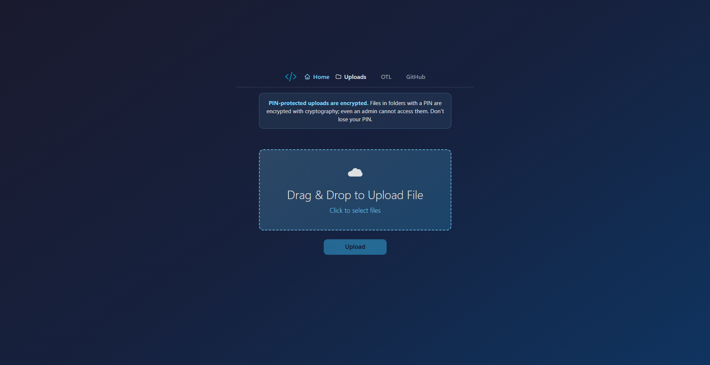

# File Transfer Server

Flask app for uploading and downloading files over the web. Optional **PIN protection**, **per-folder encryption**, and **one-time links (OTL)** help keep your files private or shared safely.

<p align="center">
  
</p>

## Quick Commands

```bash
pip install inert-transfer
```
```bash
inert      # starts the server on port 8069
```
```bash
inert <port>     # starts the server on the specified port
inert status     # shows the status of the server
inert stop     # stops the server
inert -h     # shows the help menu
```

## Setup

```bash
pip install -r requirements.txt
python server.py
```

Runs at **[http://0.0.0.0:8069](http://0.0.0.0:8069)** (port 8069, all interfaces). Use `python server.py 80` for port 80 or `python server.py <port>` for a custom port.

Set `FLASK_SECRET_KEY` in the environment for production (needed for session/PIN unlock).

## How it works

- **Home (`/`)** — Upload files by drag-and-drop or click. Use **Select folder** (or drop a folder) to upload a whole directory: the browser zips it first, then it is saved as one archive under your IP folder.
- **Uploads (`/uploads`)** — List folders (one per client IP). Open yours to see files and folder uploads (shown as `.zip`); download or delete as needed.
- Files are stored under `uploads/<client_ip>/`. Client IP is taken from the request (or from `X-Forwarded-For` / `X-Real-IP` when behind a proxy).
- **WebSocket** — Echo endpoint at `/websocket`.

## OTL (one-time link)

In the nav, **OTL** opens the one-time share page (`/one-time-link`). You pick **one** file and click **Done**; the server returns a **single-use** download link.

- The **first** person who opens the link downloads the file.
- After that, the link no longer works and the file is **removed** from the server.

Pending OTL files and metadata are **not** stored inside `uploads/`:

| Location                                                    | Purpose                            |
| ----------------------------------------------------------- | ---------------------------------- |
| `onetime/` (next to your `uploads/` folder)                 | File waiting to be downloaded once |
| `.onetime_registry.json` (same parent folder as `uploads/`) | Token metadata for active links    |

## Folder PIN protection

Folders are **public by default**. You can protect your own folder (the one matching your IP) with a PIN.

- On **Uploads**, your folder has a **⋯ (three dots)** menu. Click it to open a popup.
- **Set a PIN** — Choose a PIN (at least 4 characters). Only people who know the PIN can open the folder or download files. You must enter the PIN too when you open the folder (once per browser session).
- **Change PIN** — Open the folder and enter the current PIN first, then use the ⋯ menu and enter a new PIN.
- **Remove PIN** — Open the folder and enter the PIN first, then use the ⋯ menu and click “Remove PIN”.

PINs are stored **hashed** in `uploads/.folder_pins.json` (never in plain text).

## Per-folder encryption (FEK protected by PIN)

When you **set a PIN**, the server also turns on **per-folder encryption**:

- **FEK (folder encryption key)** — A random key is generated for your folder. All files in that folder are encrypted with this key before being saved to disk.
- **KEK (key encryption key)** — Derived from your PIN (PBKDF2-SHA256, 100 000 iterations, per-folder salt). The FEK is encrypted with the KEK and stored in `uploads/.folder_pins.json`.
- **Unlock** — When you enter the PIN, the server derives the KEK, decrypts the FEK, and keeps it in the session so you can upload and download without re-entering the PIN until the session ends.

So: **data on disk is encrypted**; only someone who knows the PIN can decrypt. Changing the PIN re-encrypts files with a new key; removing the PIN decrypts all files and removes the PIN.

Inside a `.folder_pins.json`

```json
{
  "192.168.2.9": {
    "hash": "pbkdf2:sha256:1000000$RwEyBZC3Fdl2JkDD$5b063b6cbcaa1f26b8825bafdbe978f1ae1d0177526597f52ee22a3e8235f737",
    "salt": "/AFOGJENcr4VXstcR2aYNQ==",
    "encrypted_fek": "Z0FBQUFBQnBvYkNROXJjblBvYVhRQUZReUVWUnk5ZjNfdGF2SlZCMTRLS2tVMXREMmxVbWRLT3hUVGlLcFRMT0ZVMHhvYXJPSHFIcE9DclVHZDNqdHFsZ2FGTFZMNTN3T3NHYThWX1J1SnJlSDBsdzI5ZS1EZnZtZDN0SVlNUkVpTkFFV19xQjJSNVU="
  }
}
```

### Flow summary

| Action         | What happens                                                                                                                                                                    |
| -------------- | ------------------------------------------------------------------------------------------------------------------------------------------------------------------------------- |
| **Set PIN**    | New FEK created, encrypted with KEK from PIN; all existing files encrypted with FEK; FEK stored in session.                                                                     |
| **Unlock**     | PIN checked → KEK derived → FEK decrypted → stored in session.                                                                                                                  |
| **Upload**     | If folder is encrypted and session has FEK, file content is encrypted with FEK before saving. If encrypted but no FEK in session, you must open the folder and enter PIN first. |
| **Download**   | If folder is encrypted, file is decrypted with FEK from session and sent.                                                                                                       |
| **Change PIN** | Current FEK from session used to decrypt all files; new FEK/KEK created; all files re-encrypted. (Open folder and enter current PIN first.)                                     |
| **Remove PIN** | FEK from session used to decrypt all files; PIN and encrypted FEK removed. (Open folder and enter PIN first.)                                                                   |

### Important notes

- **Remove PIN / Change PIN** — You must **open the folder and enter the PIN** in that session first. Then you can remove or change the PIN from the ⋯ menu.
- **Wrong PIN attempt limit** — After 9 wrong PIN attempts, a custom warning popup appears for the final attempt. If the 10th attempt is also wrong (and the user confirms), the folder is permanently deleted and its PIN details are removed from `uploads/.folder_pins.json`.
- **Cross-PC / cache clear unlock** — After entering the correct PIN, downloads are decrypted and PIN change/remove work, even on another PC or after clearing browser cache.
- **Folder delete cleanup** — Deleting a folder also removes that folder’s record from `uploads/.folder_pins.json`.
- **Lost PIN** — If the PIN is forgotten, encrypted files **cannot be recovered** (by design).
- **Backward compatibility** — Old PIN entries (hash only, no `encrypted_fek`) still work as “PIN gate” only; new or changed PINs get full encryption.

## Requirements

- Python 3.x
- See [requirements.txt](requirements.txt) (Flask, Werkzeug, flask-sock, **cryptography** for encryption).

## Author

Inert Tila

- 🌐 [Website](https://inert.netlify.app)
- 🔗 [LinkedIn](https://al.linkedin.com/in/inerttila)
- 📦 [PyPI](https://pypi.org/project/inert-transfer/)
